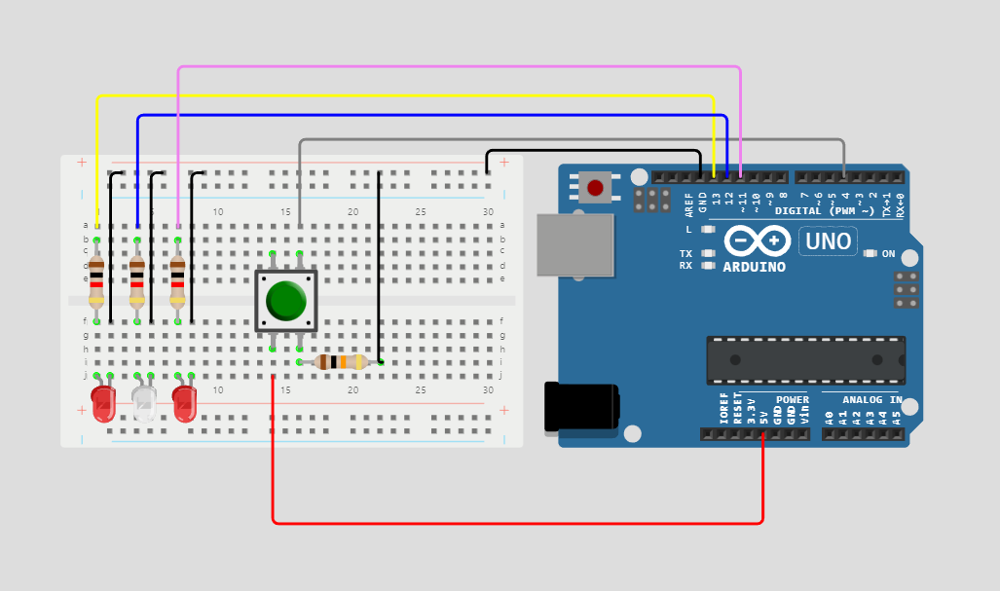
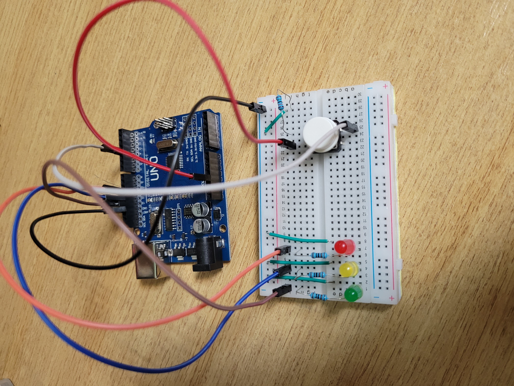

# individual-project-Alexandra150201
individual-project-Alexandra150201 created by GitHub Classroom

# 3 leds circuit

This app is an arduino app which creates a simple project with 3 leds and one button. 
The idea of the app is to light up the leds in an specific order when you press the button. 
The first led would light up and stay on, but the others 2 will blink with different periods of time.

## Clip about the implementation

[(Watch the clip)][clip]

## Schematics

## Pre-requisites

1.   Arduino Uno.
2.   3 x 1000 ohms Resistor. 
3.   1 x 10k ohms Resistor.
4.   3 x LEDs (5mm).
5.   Push button.
6.   Breadboard.
7.   Jumper wire.   
     
## Setup and Build

To setup, follow these steps below.

1. A push button having 4 pins and we use 3 pins of the push button for controlling LED.

2. Connecting Button pin 4 to Arduino pin 5v using a jumper wire.

3. Attach a 10k ohms resistor to button pin 2 and at the end of the resistor is connected to Arduino pin GND.

4. Button pin 1 is connected to Arduino digital pin 4 using a jumper wire.

5. Attach a 1000 ohms resistor to the positive pin (anode) of each led and at the end of the resistor is connected to Arduino digital pins.

6. Connecting Negative pin of the LED to Arduino pin GND using a jumper wire.

7. The circuit is ready.

## Running

To run the `app` module on an Android Things board:

1. Connect the arduino to the computer and start arduino IDE
2. Upload and run the code
3. Push the button to switch the leds

[clip]: https://user-images.githubusercontent.com/100190688/226097208-2a4882ad-6d0c-4454-b16f-481133b7c51b.mp4
[demo-gif]: demo1.gif
